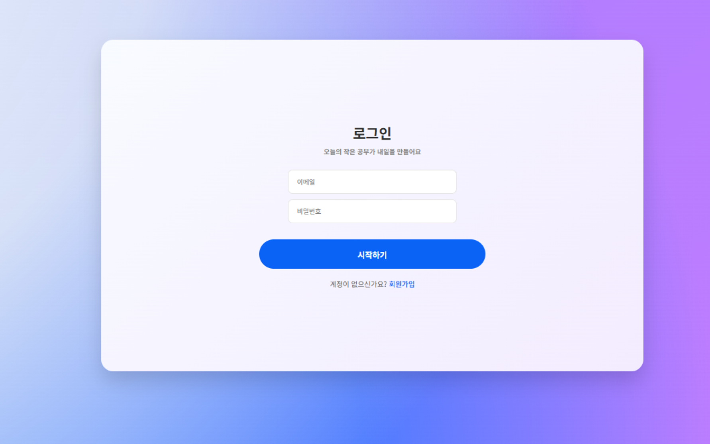
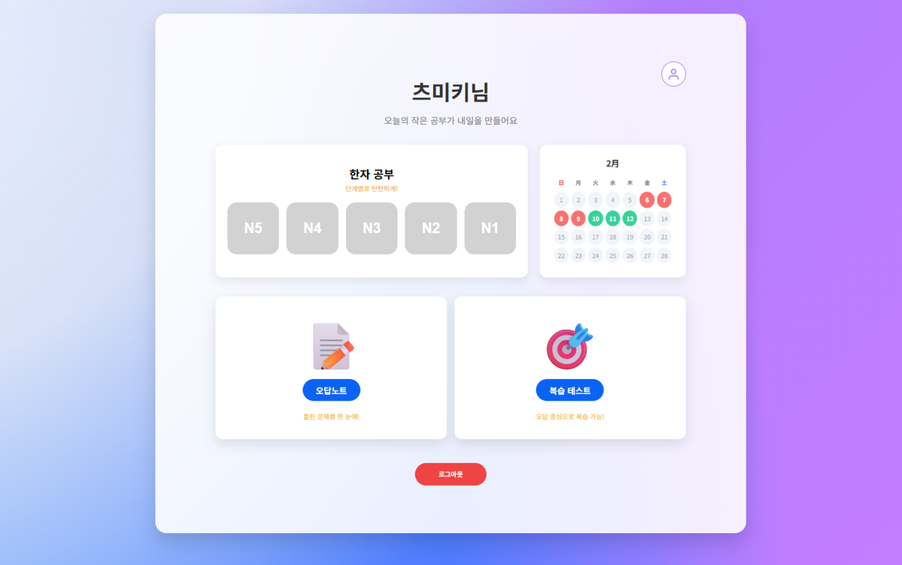
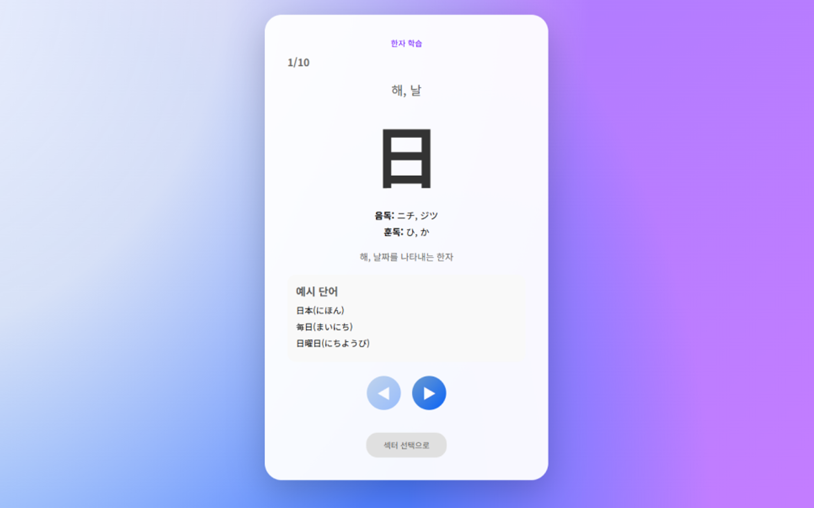
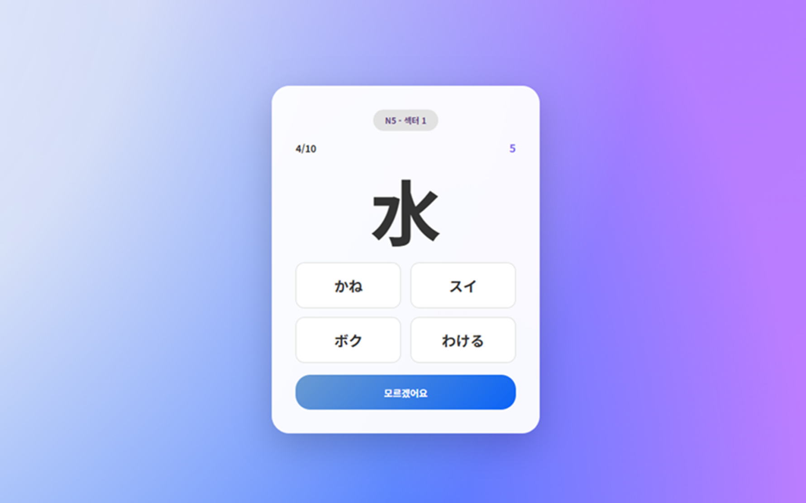
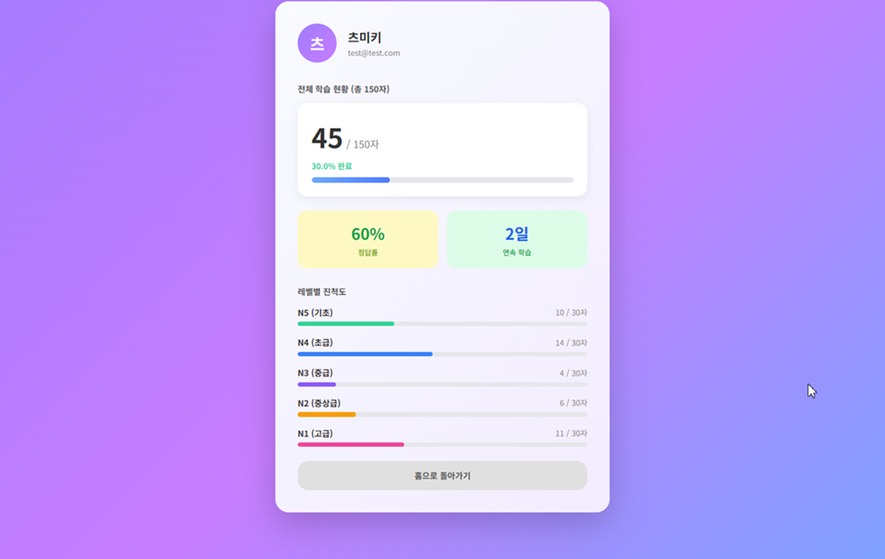

# 漢字オボエ（한자오보에）

日本語学習者のための漢字暗記Webサービスです。  
JLPT N5〜N1の漢字をレベル別に学習・テスト・進捗管理できます。

## 概要

日本語学習の経験をもとに、既存の漢字学習アプリの長所を取り入れつつ、不足していた機能を補強して開発しました。

| 参考サービス | 改善ポイント |
|---|---|
| NihongoKanji.com | 進捗管理機能を追加 |
| 回読 JLPT | テスト機能を追加 |
| Anki（暗記） | ユーザーフレンドリーなUIを実現 |

## スクリーンショット

### ログイン画面


### メインページ


### 学習画面


### テスト画面


### マイページ


## 主な機能

### 学習機能
- 漢字の音読み・訓読み・意味・例文を表示
- レベル → セクター → 漢字のインデックス構造で学習量を管理
- 1日1セクターを目安とした学習量の調整
- JLPTの出題範囲に基づいた漢字データ（Webクローリングで収集）

### テスト機能
- 四択問題形式のクイズ
- 正誤の即時フィードバック（正解：青、不正解：赤＋正答表示）
- 「わからない」ボタンで正答のみ表示
- 制限時間付き（タイマー終了時に正答表示）
- 正答・誤答の履歴を保存
- 誤答ノートからの復習・再テスト機能

### マイページ
- 全体および各レベル別の学習進捗をプログレスバーで表示
- 正答率・連続出席日数の確認
- カレンダーによる学習履歴の可視化

### 会員機能
- 会員登録・ログイン
- ニックネーム重複チェック
- 出席管理（1セクターのテスト完了時に出席チェック）

## 技術スタック

| 区分 | 技術 |
|---|---|
| フロントエンド | JSP / Scriptlet, CSS |
| バックエンド | Java / Servlet |
| データベース | Oracle |
| データ収集 | Web Crawling（Java） |

## データベース構成

**会員テーブル（Account）**  
accID, userID, userPW, email, attendance, nickname, regDate

**ログテーブル（Log）**  
logID(PK), accID(FK), kanjiID(FK), is_correct, studied_at

**漢字テーブル（Kanji）**  
kanjiID, kanjiINDEX, kanji, onyomi(1〜3), kunyomi(1〜3), meaning, example(1〜3), add_date

## ユーザーフロー

```
ユーザー → ログイン/会員登録 → メインページ
  ├── レベル選択 → セクター学習 → セクターテスト
  │                └── 誤答学習 → 誤答テスト
  ├── 累積テスト
  └── マイページ（進捗確認）
```

## チーム情報

**TEAM 積み木**（6名によるチーム開発）

| メンバー | 担当 |
|---|---|
| チョン・ジェヒョン（リーダー） | Git管理・コード統合、学習機能 |
| **オ・テヨン（サブリーダー）** ← 担当者 | **漢字DBモデリング設計・管理、復習機能** |
| ナム・スンホ | 漢字データクローリング、会員登録・ログイン機能 |
| アン・スンゴン | UI/UXデザイン、テスト機能 |
| チェ・チョルウク | ログDBモデリング設計・管理、テスト機能 |
| イ・ユジン | 会員DBモデリング設計・管理、マイページ機能 |

## リンク

- [リポジトリ](https://github.com/otyotyoty/Team_Tsumiki_KanjiOboe)
